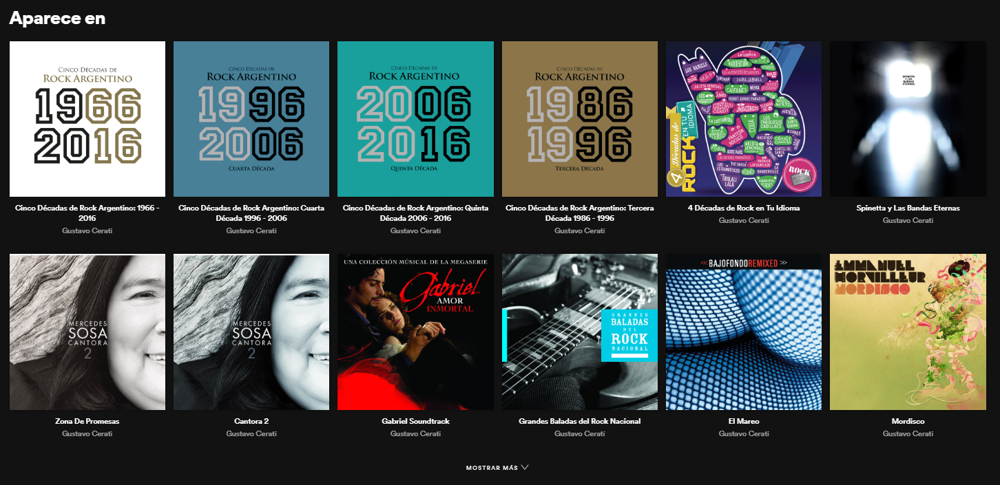

# Bienvenido a los desafíos de código de Python Patagonia

En este repositorio encontraremos los desafíos propuestos en el meetup del 21/12. En la carpeta **Soluciones** vas a encontrar las respuestas de los asistentes.

# Desafíos

Todos los desafíos se tratan de web scraping y varían en complejidad, elegí el que te resulte mas atractivo.

## Desafío MELI

Dado un link correspondiente a un categoría de producto en el sitio Mercado Libre, obtener los _n primeros_ productos que tengan un descuento superior igual a un _valor_ indicado por el usuario.
El script deberá mostrar:
- Nombre del producto
- Precio normal
- Precio con descuento,
- Enlace

Ejemplos de entradas:
- Enlace categoría del producto:
	- [https://electronica.mercadolibre.com.ar/drones-accesorios-mini/](https://electronica.mercadolibre.com.ar/drones-accesorios-mini/)
- N: Primeros 20 artículos.
- Descuento: 20%

### Extra
Extender el desafío a una lista de categorías

## Desafío Spotify

Dado un artista, se deberán obtener los nombres de los discos listados en el apartado __"Aparece en"__ de la portada del mismo y el enlace a su correspondiente sección en Spotify.
Ejemplo de entradas:
- Artista/enlace: Gustavo Cerati / [https://open.spotify.com/artist/1QOmebWGB6FdFtW7Bo3F0W](https://open.spotify.com/artist/1QOmebWGB6FdFtW7Bo3F0W)

### Extra
Extender el desafío a una lista de artistas

## Desafío Modernización
Obtener los datasets ofrecidos por el ministerio de modernización cuya fecha de actualización sea mayor a una ingresada por el usuario.
Enlace de trabajo:
- [https://datos.gob.ar/dataset](https://datos.gob.ar/dataset)

# Soluciones

Para aportar al desafío, subir las soluciones a la carpeta correspondiente:
- desafio-meli
- desafio-spotify
- desafio-modernizacion
- ... 
